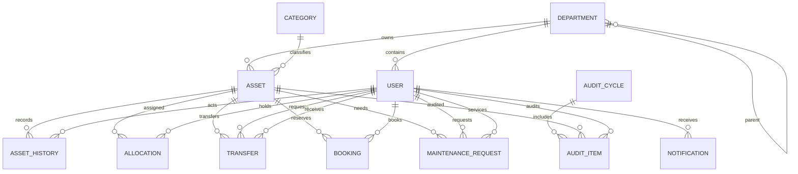

# ER Diagram Description

AssetFlow is centered on `Asset`, with users, departments, categories, and workflow tables connected through foreign keys. The schema is normalized so operational history is retained instead of overwritten.

## Entity Groups

### Identity And Organization

- `User`: system account, role, email, password hash, optional department membership.
- `Department`: organization unit with optional `parentDepartmentId` for hierarchy.

Relationships:

- One `Department` has many `User` records.
- One `Department` has many child `Department` records.
- Department deletion sets related user and asset department references to null.

### Asset Master Data

- `Category`: asset taxonomy and generated tag prefix.
- `Asset`: asset tag, serial number, status, value, purchase date, location, category, department, photo URL.
- `AssetHistory`: immutable event log for asset registration, status changes, allocation, transfer, booking, maintenance, and audit actions.

Relationships:

- One `Category` has many `Asset` records.
- One `Department` has many `Asset` records.
- One `Asset` has many `AssetHistory` records.
- One `User` may be the actor on many `AssetHistory` records.

### Workflow

- `Allocation`: issue/return lifecycle for assets assigned to users.
- `Transfer`: request and approval lifecycle for asset handover.
- `Booking`: scheduled reservation for shared resources.
- `MaintenanceRequest`: repair/support workflow with requester, optional technician, status, priority, and attachments.

Relationships:

- One `Asset` has many `Allocation`, `Transfer`, `Booking`, and `MaintenanceRequest` records.
- One `User` has many allocations as holder.
- One `User` has many transfers as requester and may receive many transfers.
- One `User` has many bookings.
- One `User` has many maintenance requests as requester and may be assigned as technician.

### Audit And Notifications

- `AuditCycle`: audit batch with start/end dates and lifecycle status.
- `AuditItem`: one asset inside an audit cycle, with auditor, status, notes, and verification time.
- `Notification`: user inbox item.

Relationships:

- One `AuditCycle` has many `AuditItem` records.
- One `Asset` has many `AuditItem` records.
- One `User` may audit many `AuditItem` records.
- One `User` has many `Notification` records.

## Cardinality Summary

```text
Department 1 ---- * User
Department 1 ---- * Department
Department 1 ---- * Asset
Category   1 ---- * Asset
Asset      1 ---- * AssetHistory
User       1 ---- * AssetHistory
Asset      1 ---- * Allocation
User       1 ---- * Allocation
Asset      1 ---- * Transfer
User       1 ---- * Transfer requester
User       1 ---- * Transfer receiver
Asset      1 ---- * Booking
User       1 ---- * Booking
Asset      1 ---- * MaintenanceRequest
User       1 ---- * MaintenanceRequest requester
User       1 ---- * MaintenanceRequest technician
AuditCycle 1 ---- * AuditItem
Asset      1 ---- * AuditItem
User       1 ---- * AuditItem auditor
User       1 ---- * Notification
```

## Important Constraints

- `users.email`, `departments.name`, `departments.code`, `categories.name`, `categories.prefix`, `assets.assetTag`, and `assets.serialNo` are unique.
- `audit_items` is unique on `(auditCycleId, assetId)`.
- A PostgreSQL partial unique index enforces one active allocation per asset:

```sql
CREATE UNIQUE INDEX "allocations_one_active_asset_idx"
ON "allocations"("assetId")
WHERE "status" = 'ACTIVE' AND "deletedAt" IS NULL;
```

## Mermaid ERD


